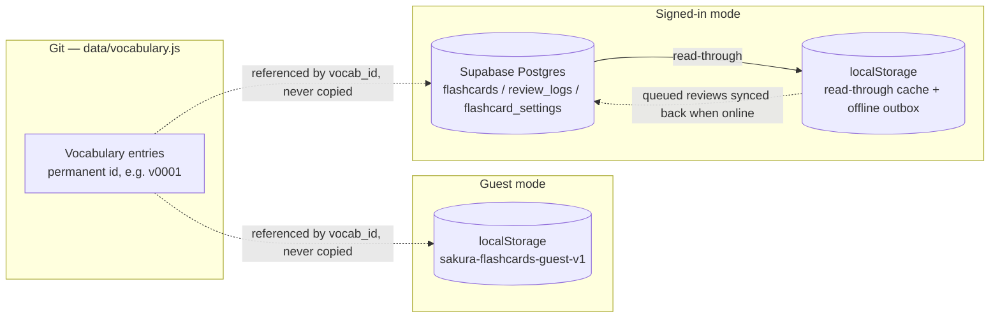
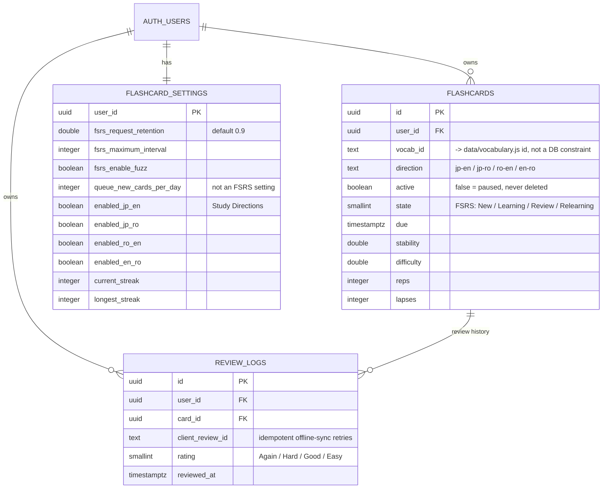

# Japanese Study Reference

A fast reference site for food, kitchen, and N5 vocabulary. Built for quick lookup while cooking or studying, and for printing clean study sheets.

Live at [xxvazquez.github.io/japanese-study](https://xxvazquez.github.io/japanese-study/).

## Brand

"sakura" — the wordmark sits at the left of the header opposite a small `JAPANESE REFERENCE`, and goes with `logo.png` (a circular mark: sun, hills, a leaf, waves). The wordmark is set in [Space Grotesk](https://fonts.google.com/specimen/Space+Grotesk) (self-hosted, SIL OFL) — the one place a second typeface is used, to give the mark some personality; every other element is Inter. Hierarchy is carried by size, spacing, position and colour rather than bold weight or high contrast.

Each of the four sections (Vocabulary, Grammar, Travel, Flashcards) has one muted, desaturated cool tone that colours only its structural/interactive elements — the page title's ink, the active nav underline, category headings and their rules, active filters and tabs, focus and sort accents. Rows and large surfaces stay neutral. `--section` is switched by `body[data-active-*]`; the per-section values live in `:root` as `--sec-vocabulary` (muted blue), `--sec-grammar` (muted indigo), `--sec-travel` (muted blue-green), `--sec-flashcards` (muted slate).

The palette is deliberately quiet and cool — a light "sheet" on a grey-blue ground, one restrained slate-blue accent, and no warm tones. As CSS custom properties in `css/site.css`:

| Hex | CSS variable | Used for |
|---|---|---|
| `#2F3944` | `--ink` | primary text — dark blue-grey, never black |
| `#5F6B79` / `#8996A3` | `--muted` / `--faint` | secondary text (labels) / tertiary (counts, chevrons) |
| `#616D7B` / `#64707E` | `--romaji` / `--furigana` | the romaji column / the reading over each kanji — both held at WCAG AA (≥ 4.5:1 on `--paper`); furigana also has an 11px floor so small kana stay readable |
| `#EEF1F4` | `--page-bg` | the cool grey behind the sheet |
| `#FFFFFF` | `--paper` | the sheet and table surface |
| `#E3E8EC` / `#D3DBE2` | `--line` / `--line-strong` | hairline row rules / borders, header + table-head rules |
| `#526D87` / `#405A73` | `--accent` / `--accent-strong` | the single accent — active nav/tabs/controls, focus, search-match wash |

Two colours do a narrow functional job and nothing decorative: a calm slate wash (`--irregular-bg` / `--irregular-ink`) marks irregular-verb rows, and a muted brick red (`--wrong`) is used only for a wrong or missed flashcard answer. There is no pink, no gradient, no shadow beyond a single soft one under the table overflow menu.

## What's here

- `index.html` — the page shell: header (wordmark + light/dark toggle), the four-item navigation, the vocabulary-section page (`#tableIndex` directory + sticky search/controls + tables) and the Flashcards page. Its `<script>` block documents the load order.
- `js/theme-init.js` — tiny `<head>` script: sets `<html data-theme-choice>` (`system` \| `light` \| `dark`) and the resolved `<html data-theme>` (`light` \| `dark`, what the CSS keys off) before the first paint so the theme never flashes.
- `css/site.css` — styling and print rules
- `fonts/InterVariable.woff2` — self-hosted [Inter](https://rsms.me/inter/) variable font (SIL OFL, `fonts/Inter.LICENSE.txt`) for all Latin/UI text; one local file, no external font runtime. Japanese keeps its Noto stack.
- `fonts/SpaceGrotesk.woff2` — self-hosted [Space Grotesk](https://fonts.google.com/specimen/Space+Grotesk) (SIL OFL, `fonts/SpaceGrotesk.LICENSE.txt`), latin weight 400 only, used solely for the `sakura` wordmark.
- `js/config.js` — your Supabase project URL + anon key (see `SUPABASE_SETUP.md`)
- `js/shared.js` — helpers used by more than one feature (currently just HTML escaping)
- `js/vocab/` — the vocabulary page: `render.js` (tables + the four-item navigation, sorting), `interactions.js` (section routing, search, view modes, menus, print, polite toggle)
- `js/flashcards/` — the Flashcards feature, split by responsibility: `store.js` (state & local storage), `vocab-index.js` (lookup + answer checking), `scheduling.js` (FSRS-6 + queue/stats), `data-ops.js` (auth, Supabase sync, guest store, streak), `dashboard.js` (Dashboard tab + insights + review session), `views.js` (Manage/Settings/Help + row toggle), `bootstrap.js` (app shell + init). See Flashcards, below.
- `js/sw-register.js` — registers the service worker (see PWA, below)
- `data/vocabulary.js` — the actual vocab, as plain data (not HTML), each row carrying a permanent id
- `vendor/` — vendored `ts-fsrs` and `supabase-js`, static files (see Flashcards, below)

All first-party code is loaded as plain classic `<script>`s (no bundler, no modules, works from `file://`) and communicates through a single global, `window.SakuraStudy`, with one sub-namespace per area: `.data`, `.config`, `.shared`, `.vocab`, `.flashcards`. Each file only reads namespaces that a file above it in `index.html` has already populated. The vendored libraries keep their own globals (`window.FSRS`, `window.supabase`).
- `supabase/schema.sql` — the Postgres tables + Row Level Security policies for Flashcards
- `SUPABASE_SETUP.md` — step-by-step Supabase project setup
- `logo.png` — site mark / favicon
- `icons/` — generated app icons for the home-screen/install experience (see PWA)
- `manifest.webmanifest` — web app manifest (name, icons, theme color, display mode)
- `sw.js` — service worker: caches the app shell for offline use
- `scripts/` — a data validator, a vocab-id generator, and a smoke test, see below

No framework, no build step. Just open `index.html`.

## Features

- Search across Japanese, furigana, romaji, and English, with **Japanese / Romaji / Meaning** filters (matching the column names) that scope the search to one field and show only that column
- Results sorted by how good the match is (exact → starts with → ends with → contains), matched text highlighted, and pulled in from every section even if you're not currently viewing it
- Four main study areas in the navigation — **Vocabulary**, **Grammar**, **Travel**, **Flashcards**. Vocabulary is the landing page; inside it the tables are still grouped by content category (Food & Ingredients, Kitchen & Dining, Numbers & Counting). Grammar and Travel are promoted to their own sections.
- Each section opens with a **table directory** (`#tableIndex`) — closed, it's a small control naming the table you're on; open, it lays the whole section out at once (every category as a quiet label, every table listed beneath with an entry count aligned in a gutter, nothing to expand). Two columns on a wide screen, a bounded bottom sheet on a phone; the table you're viewing is marked with the section colour; keyboard-navigable, hidden during a search and never printed
- The search field and column filters stay **stuck below the navigation** as you scroll a long table
- The URL hash tracks the view — `#grammar`, `#table-15`, `#flashcards` — so a section or a specific table can be bookmarked, shared and survives a reload; browser back/forward work
- Sortable columns (↓ = A–Z / low→high, ↑ = Z–A / high→low; every table starts sorted A–Z by meaning), per-table print, A4-friendly print layout
- A section opens showing just its first table; the rest are one click away. Opening a table collapses the others in its category, so a category never shows more than one open at a time. An **Expand all** toggle above the tables opens every table in the section at once (and back to the one-open default), and steps aside while you search
- A **Show polite** toggle switches verb tables between the plain/dictionary form and the polite 〜ます form; it only appears while the Verbs table is actually expanded (not just present-but-collapsed)
- "Manage rows" lets you hide individual rows you've already memorized, per table, with a one-click "Show all" to bring them back
- **Flashcards**: turn any vocabulary row into an FSRS-6-scheduled flashcard (see below)
- Furigana sits over the actual kanji it belongs to, not the whole word, and is always shown — never behind a hover or a toggle; it keeps an 11px floor so small kana stay readable when the Japanese steps down on narrow screens, with a touch of extra row padding above the Japanese cell so it never touches the row rule
- A header theme control that cycles **System → Light → Dark** (icon and label reflect the current mode); "System" follows the OS setting live. `js/theme-init.js` applies it before first paint, the rest is in `interactions.js`; a stored value means an explicit Light/Dark, its absence means System
- On mobile the sheet goes full-width; the four-item navigation still fits on one line
- Installable as a PWA on iPhone and Android, and works offline once visited (see below)

## PWA (installing on iPhone / Android)

The site is an installable, offline-capable PWA:

- **Android / Chrome, desktop Chrome & Edge**: an "Install app" prompt appears automatically (or use the browser menu → "Install app" / "Add to Home Screen"). Backed by `manifest.webmanifest` plus `sw.js`, a service worker that precaches the app shell and caches versioned assets as you browse.
- **iPhone / iPad (Safari)**: iOS doesn't support the install prompt or manifest icons the way Android does, so those are covered separately — Share → "Add to Home Screen" uses the `apple-touch-icon` and `apple-mobile-web-app-*` meta tags in `index.html` for the icon, name, and standalone (no browser chrome) launch behavior.
- Regenerating icons: the source art is `logo.png` (transparent, not necessarily square or tightly cropped — the generation script crops to the opaque content's bounding box first, then pads it back out to a square before resizing, so icons stay centered regardless of the source file's own margins). See the Python/Pillow snippet used to derive `icons/*.png` in the git history if you need to regenerate them after changing the logo — sizes needed are 192/512 (`any`), 192/512 (`maskable`, ~72% safe-zone art), and a white-flattened 180×180 for `apple-touch-icon.png` (iOS doesn't composite transparency the way Android does).
- The service worker's cache name (`sakura-v1` in `sw.js`) only needs bumping if you change what the *app shell itself* precaches (the list at the top of `sw.js`) — versioned assets (`?v=<sha>`) already invalidate themselves on every deploy via the cache-busting step below.

## Flashcards

An additive feature on top of the existing vocabulary — it doesn't change or duplicate it. Every table has an "Add to flashcards" button (next to "Manage rows") that adds every one of its rows at once — it skips any row you've already hidden in that table, so words you've marked as already-known don't get pulled back in. Prefer to pick individual words instead? Each row has an add/remove toggle at its right edge — it surfaces on hover (or keyboard focus) on pointer devices and is always shown, faint, on touch; once a word is added its toggle stays lit. (The eye/hide icon still lives behind "Manage rows".) A "Flashcards" page in the top navigation then lets you review, browse, and track progress (including a daily study streak).

- Real **FSRS-6** scheduling via [`ts-fsrs`](https://github.com/open-spaced-repetition/ts-fsrs) (the official reference implementation, same org behind Anki's own FSRS), vendored as a static file at `vendor/ts-fsrs.js` — no build step added to the site itself.
- Each vocab entry becomes up to 4 independently-scheduled cards (Japanese→English, Japanese→Romaji, Romaji→English, English→Romaji) — never Japanese-to-type. Any row whose "romaji" field isn't usable as a typed answer (still kana) is limited to Japanese→English only; the Numbers table now carries real romaji, so its rows get all four. Which of the 4 directions "Study now" actually draws from is a Settings toggle ("Study Directions") — turning one off never touches its cards or history, just leaves it out of review until switched back on. Within whichever directions are on, the whole session is shuffled as one pool — every card that's ready (review cards that are due, plus learning/relearning steps due within a 20-minute look-ahead so finishing a session isn't blocked waiting a short step out) plus that day's allowance of new cards, dealt in a fresh random order each session so it's never the same word/direction sequence twice, then spaced so a word's other directions never land back to back. Nothing is kept soonest-due-first; FSRS still decides *which* cards are due and *when* they come back, just not their order within the session.
- Every vocabulary row has a **permanent id** (`v0001`, `v0002`, …, see `data/vocabulary.js` / `scripts/generate-vocab-ids.js`) that flashcards reference — never a copy of the row's content.
- **Two ways to use it, your choice**: "Continue without an account" keeps everything in this browser's `localStorage` only — no setup, no network, nothing to sign in to. Or sign in (free) to sync flashcards, history, and settings across devices via **Supabase** (a hosted Postgres + Auth project you create yourself — see [`SUPABASE_SETUP.md`](SUPABASE_SETUP.md)), which is then the sole authoritative store, scoped per account by Row Level Security. The anon/public key in `js/config.js` is safe to commit — RLS is what protects the data, not secrecy of that key. Never put the *service role* key anywhere in this repo. The two modes' data never mix — switching from one to the other never overwrites what's in the other.
- When signed in, `localStorage` is only a read-through cache and an offline outbox — reviews taken without a connection are computed locally and synced once you're back online; it's never the permanent record there.
- The **Dashboard**, before anything is added, is just an empty state pointing at the next step (Browse vocabulary / Choose tables in Manage) rather than a grid of zeroes. Once there are cards it shows today's progress (cards reviewed vs. the daily new-card target); a status line that always matches the "Study now" button (`N to study` when a session has something in it, otherwise `All caught up` plus the next review time, straight from the FSRS schedule — and it re-checks itself on a slow poll, so a learning step coming due lights the button up without a manual reload); four stat tiles (day streak, total cards, reviews completed, estimated retention — which stays "—" until at least five cards have been reviewed, since the average is noise below that); a **Card progress** bar (New → Learning → Review as a light-to-dark ramp of the one accent hue); a **Reviews this week** bar chart (days with no reviews are a flat baseline, not a stunted bar); a "Missed today" shortlist (words missed in today's reviews, most-missed first — click one to practice it); and a **Words to Review** table (missed more than once over time) rendered as a normal vocabulary table so it sorts and prints like the rest.
- The **Manage** tab lists every table by category (filterable to All / My flashcards / Archived), collapsed by default. Each table shows only the action that applies — **Add table** until it's fully added, then **Pause table** — with no dead disabled buttons, and each category with more than one un-added table gets an **Add all N remaining tables** shortcut. Expand a table to add/pause individual words.
- A **review session** runs card → check → rate; every rating is committed immediately, so **End session** (top-right of the card) stops early without losing anything. After a wrong or blank answer, Good/Easy are dimmed (still one click away — typos happen) so the honest choice reads first. Finishing or ending shows a wrap-up — how many reviewed, how many correct, the current streak — with **Keep going** when more cards are ready.
- A **Settings** tab groups Study Directions, the FSRS knobs (desired retention, max interval, fuzz) and new-cards-per-day under one **Save settings** button with an inline "Saved ✓" confirmation — every value is written locally first, then synced.
- A **Help** tab documents pausing, the Manage status icons (○ / ● / ◷), review sessions and their keyboard shortcuts (Space/Enter to check, 1–4 to rate), and the casual/polite toggle.
- Removing ("pausing") a vocab entry from flashcards **archives** it — its FSRS state and full review history are kept, and re-adding it later restores the same card rather than starting over. There is no way to permanently delete a card's learning history; a paused card keeps it indefinitely.
- Re-vendoring the libraries after a version bump: `npm install && npm run vendor:libs`.

### Data model

Vocabulary content lives only in Git; the two storage modes each hold nothing but a reference to it (`vocab_id`) plus your own learning data:



The Supabase schema itself (see [`supabase/schema.sql`](supabase/schema.sql) — guest mode mirrors the same shape locally instead of these tables):



## Running it

Just open `index.html`. No server needed, though `python3 -m http.server` or similar works fine too if you want it on localhost — and you'll need it (or any local server) if you want to test the service worker/offline behavior, since browsers refuse to register one on a bare `file://` page. The rest of the site works fine either way.

## Scripts

```
npm run validate            # checks the vocab data is well-formed (no deps needed)
npm install && npm test     # actually renders the page and clicks around (uses jsdom)
npm run generate:vocab-ids  # assigns a permanent id to any vocab row that doesn't have one yet
npm run vendor:libs         # re-copies vendor/ts-fsrs.js and vendor/supabase.js after a version bump
```

Run `npm run validate` before committing data changes — it'll catch duplicate entries, missing fields, missing/duplicate ids, that sort of thing. `npm test` is heavier and checks real behavior (search, keyboard nav, print, flashcards navigation and answer-checking), worth running before anything that touches `app.js` or `flashcards.js`.

## Deploying

Pushing to `main` deploys via the GitHub Actions workflow in `.github/workflows/pages.yml`. It swaps a cache-busting token into the asset URLs on every deploy so you don't get stuck looking at a stale cached version. Set the repo's Pages source to "GitHub Actions" if you haven't already.
