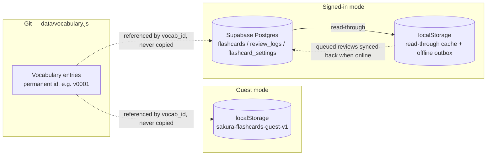
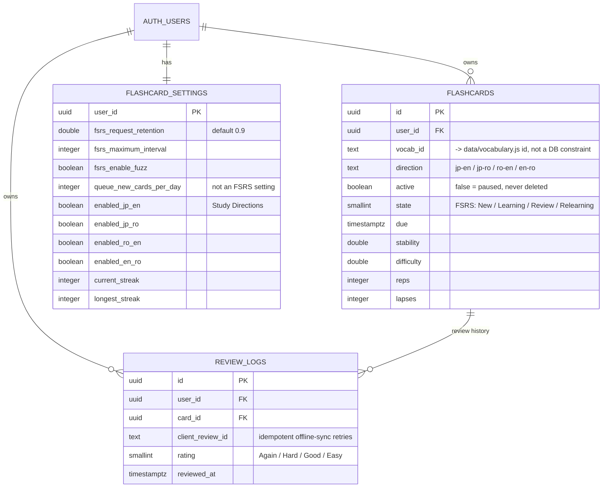

# Japanese Study Reference

A fast reference site for food, kitchen, and N5 vocabulary. Built for quick lookup while cooking or studying, and for printing clean study sheets.

Live at [xxvazquez.github.io/japanese-study](https://xxvazquez.github.io/japanese-study/).

## Brand

"sakura study" — the wordmark at the top of the sidebar, above the Overview link (`sakura` + a small tracked-out `STUDY` underneath), pairs with `logo.png`, a circular mark (sun, hills, a leaf, waves) in the same palette. The palette itself, as CSS custom properties in `css/site.css`:

| Swatch | Hex | CSS variable | Used for |
|---|---|---|---|
| Deep Teal | `#0F6B6D` | `--accent-dark` | smaller, deliberate emphasis — filled "managing rows" state, one category icon, particle highlights |
| Teal | `#2BA7A0` | `--accent` | the main brand color in use — the *specific selected table's* nav pill, links/hover accents, focus ring |
| Soft Teal | `#D6EFEE` | `--accent-soft` | soft hover/tint backgrounds |
| Light Gray | `#F4F7F8` | `--surface` / `--page-bg` | sidebar + content pane surface, and the table header row itself |
| Text Dark | `#1F2933` | `--ink` | primary text |
| Text Muted | `#6B7C85` | `--muted` | secondary text (romaji, counts, meta, table header labels) |

A dusty sakura-pink ramp rides alongside the brand palette as the one functional, non-brand accent family — never decorative, never bright/pastel (no `#FFB6C1`-style pink, which reads as the generic "cute Japanese app" look this site deliberately avoids): `--rose-blush` (`#FAF1F3`, barely-there wash), `--rose-soft` (`#F4E3E8`, tint backgrounds), `--rose` (`#C98296`, the accent itself — irregular-verb rows, search-match highlights, incorrect-answer feedback), and `--rose-dark` (`#A95F78`, for text that needs real contrast over a soft-pink background). The overall visual direction follows the "Clean Comfort" concept: a light, airy shell (white/light-gray sidebar and toolbar, not a colored panel), table chrome that stays quiet and light rather than brand-colored, and Teal reserved for exactly one job — marking the specific table you're currently on. Note that only the specific selected *table* gets the solid Teal pill; its parent category is never filled in too, even though it's also "active" in the sense of containing the current page — otherwise two different things read as selected at once.

## What's here

- `index.html` — the page shell: header, search, sidebar, overview page
- `css/site.css` — styling and print rules
- `js/app.js` — renders the tables, search, sorting, view modes, printing, the whole UI
- `js/flashcards.js` — the Flashcards feature: FSRS-6 scheduling, Supabase sync, review UI (see Flashcards, below)
- `js/supabase-config.js` — your Supabase project URL + anon key (see `SUPABASE_SETUP.md`)
- `js/sw-register.js` — registers the service worker (see PWA, below)
- `data/vocabulary.js` — the actual vocab, as plain data (not HTML), each row carrying a permanent id
- `vendor/` — vendored `ts-fsrs` and `supabase-js`, static files (see Flashcards, below)
- `supabase/schema.sql` — the Postgres tables + Row Level Security policies for Flashcards
- `SUPABASE_SETUP.md` — step-by-step Supabase project setup
- `logo.png` — site mark / favicon
- `icons/` — generated app icons for the home-screen/install experience (see PWA)
- `manifest.webmanifest` — web app manifest (name, icons, theme color, display mode)
- `sw.js` — service worker: caches the app shell for offline use
- `scripts/` — a data validator, a vocab-id generator, and a smoke test, see below

No framework, no build step. Just open `index.html`.

## Features

- Search across Japanese, furigana, romaji, and English, with filters to scope it to just one of those
- Results sorted by how good the match is (exact → starts with → ends with → contains), matched text highlighted, and pulled in from every category even if you're not currently viewing it
- Tables are grouped into categories in the sidebar; each category is its own page, so you're never scrolling past the whole book to find one table
- An Overview page (also the sidebar's landing page) lists every category and table as a plain table of contents
- Sortable columns (↓ = A–Z / low→high, ↑ = Z–A / high→low; every table starts sorted A–Z by English), per-table print, A4-friendly print layout
- A sidebar filter to jump to a table by name; opening a table collapses the others in that category so only one is expanded at a time
- A **Show polite** toggle switches verb tables between the plain/dictionary form and the polite 〜ます form — one form at a time, same table structure
- "Manage rows" lets you hide individual rows you've already memorized, per table, with a one-click "Show all" to bring them back
- **Flashcards**: turn any vocabulary row into an FSRS-6-scheduled flashcard (see below)
- Furigana sits over the actual kanji it belongs to, not the whole word
- On mobile the sidebar tucks behind a menu button instead of eating screen space
- Installable as a PWA on iPhone and Android, and works offline once visited (see below)

## PWA (installing on iPhone / Android)

The site is an installable, offline-capable PWA:

- **Android / Chrome, desktop Chrome & Edge**: an "Install app" prompt appears automatically (or use the browser menu → "Install app" / "Add to Home Screen"). Backed by `manifest.webmanifest` plus `sw.js`, a service worker that precaches the app shell and caches versioned assets as you browse.
- **iPhone / iPad (Safari)**: iOS doesn't support the install prompt or manifest icons the way Android does, so those are covered separately — Share → "Add to Home Screen" uses the `apple-touch-icon` and `apple-mobile-web-app-*` meta tags in `index.html` for the icon, name, and standalone (no browser chrome) launch behavior.
- Regenerating icons: the source art is `logo.png` (transparent, not necessarily square or tightly cropped — the generation script crops to the opaque content's bounding box first, then pads it back out to a square before resizing, so icons stay centered regardless of the source file's own margins). See the Python/Pillow snippet used to derive `icons/*.png` in the git history if you need to regenerate them after changing the logo — sizes needed are 192/512 (`any`), 192/512 (`maskable`, ~72% safe-zone art), and a white-flattened 180×180 for `apple-touch-icon.png` (iOS doesn't composite transparency the way Android does).
- The service worker's cache name (`sakura-v1` in `sw.js`) only needs bumping if you change what the *app shell itself* precaches (the list at the top of `sw.js`) — versioned assets (`?v=<sha>`) already invalidate themselves on every deploy via the cache-busting step below.

## Flashcards

An additive feature on top of the existing vocabulary — it doesn't change or duplicate it. Every table has an "Add to flashcards" button (next to "Manage rows") that adds every one of its rows at once — it skips any row you've already hidden in that table, so words you've marked as already-known don't get pulled back in. Prefer to pick individual words instead? "Manage rows" also puts a per-row add/remove toggle next to the eye icon. A "Flashcards" page in the sidebar then lets you review, browse, and track progress (including a daily study streak).

- Real **FSRS-6** scheduling via [`ts-fsrs`](https://github.com/open-spaced-repetition/ts-fsrs) (the official reference implementation, same org behind Anki's own FSRS), vendored as a static file at `vendor/ts-fsrs.js` — no build step added to the site itself.
- Each vocab entry becomes up to 4 independently-scheduled cards (Japanese→English, Japanese→Romaji, Romaji→English, English→Romaji) — never Japanese-to-type. Any row whose "romaji" field isn't usable as a typed answer (still kana) is limited to Japanese→English only; the Numbers table now carries real romaji, so its rows get all four. Which of the 4 directions "Study now" actually draws from is a Settings toggle ("Study Directions") — turning one off never touches its cards or history, just leaves it out of review until switched back on. Within whichever directions are on, review order is randomized (which due reviews and which new cards come up, not the short-interval learning queue, which stays strictly soonest-due-first) so a session isn't the same predictable word/direction sequence every time.
- Every vocabulary row has a **permanent id** (`v0001`, `v0002`, …, see `data/vocabulary.js` / `scripts/generate-vocab-ids.js`) that flashcards reference — never a copy of the row's content.
- **Two ways to use it, your choice**: "Continue without an account" keeps everything in this browser's `localStorage` only — no setup, no network, nothing to sign in to. Or sign in (free) to sync flashcards, history, and settings across devices via **Supabase** (a hosted Postgres + Auth project you create yourself — see [`SUPABASE_SETUP.md`](SUPABASE_SETUP.md)), which is then the sole authoritative store, scoped per account by Row Level Security. The anon/public key in `js/supabase-config.js` is safe to commit — RLS is what protects the data, not secrecy of that key. Never put the *service role* key anywhere in this repo. The two modes' data never mix — switching from one to the other never overwrites what's in the other.
- When signed in, `localStorage` is only a read-through cache and an offline outbox — reviews taken without a connection are computed locally and synced once you're back online; it's never the permanent record there.
- The **Dashboard** shows today's progress (cards reviewed vs. the daily new-card target), the next review time (straight from the FSRS schedule), a "Missed today" shortlist (words missed in today's reviews, most-missed first — click one to practice it), and a **Words to Review** table (missed more than once over time) rendered as a normal vocabulary table so it sorts and prints like the rest. A **Help** tab documents pausing, the Manage status icons (○ / ● / ◷), the review keyboard shortcuts (Space/Enter to check, 1–4 to rate), and the casual/polite toggle.
- Removing ("pausing") a vocab entry from flashcards **archives** it — its FSRS state and full review history are kept, and re-adding it later restores the same card rather than starting over. There is no way to permanently delete a card's learning history; a paused card keeps it indefinitely.
- Re-vendoring the libraries after a version bump: `npm install && npm run vendor:libs`.

### Data model

Vocabulary content lives only in Git; the two storage modes each hold nothing but a reference to it (`vocab_id`) plus your own learning data:



The Supabase schema itself (see [`supabase/schema.sql`](supabase/schema.sql) — guest mode mirrors the same shape locally instead of these tables):



## Running it

Just open `index.html`. No server needed, though `python3 -m http.server` or similar works fine too if you want it on localhost — and you'll need it (or any local server) if you want to test the service worker/offline behavior, since browsers refuse to register one on a bare `file://` page. The rest of the site works fine either way.

## Scripts

```
npm run validate            # checks the vocab data is well-formed (no deps needed)
npm install && npm test     # actually renders the page and clicks around (uses jsdom)
npm run generate:vocab-ids  # assigns a permanent id to any vocab row that doesn't have one yet
npm run vendor:libs         # re-copies vendor/ts-fsrs.js and vendor/supabase.js after a version bump
```

Run `npm run validate` before committing data changes — it'll catch duplicate entries, missing fields, missing/duplicate ids, that sort of thing. `npm test` is heavier and checks real behavior (search, keyboard nav, print, flashcards navigation and answer-checking), worth running before anything that touches `app.js` or `flashcards.js`.

## Deploying

Pushing to `main` deploys via the GitHub Actions workflow in `.github/workflows/pages.yml`. It swaps a cache-busting token into the asset URLs on every deploy so you don't get stuck looking at a stale cached version. Set the repo's Pages source to "GitHub Actions" if you haven't already.
